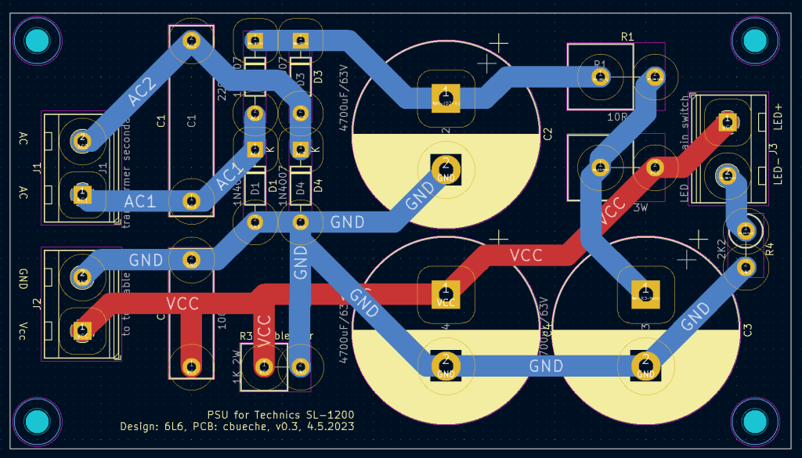
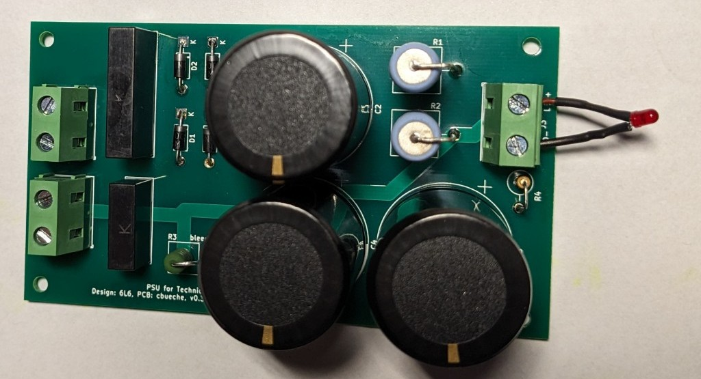
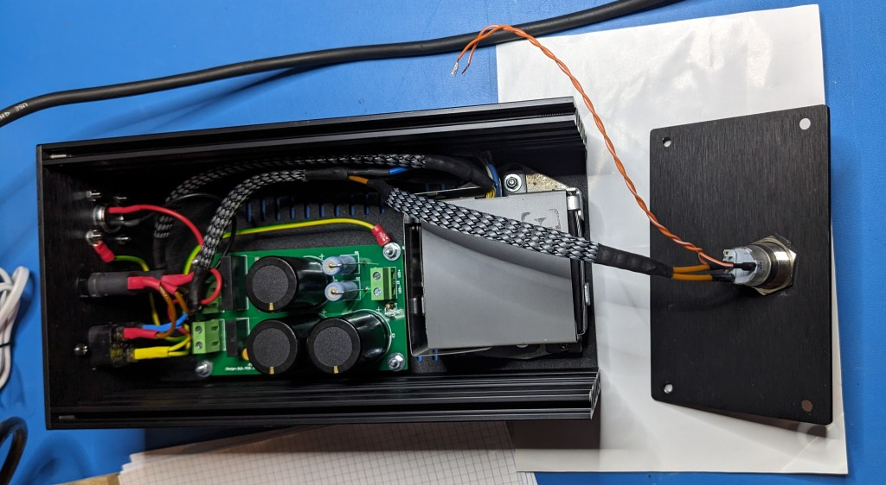
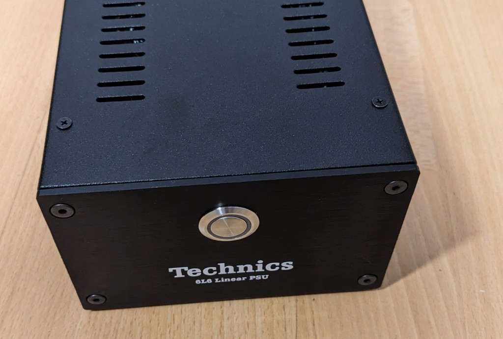

# DC PSU for the Technics SL-1200 

An external PSU (linear power supply unit) for the Technics SL-1200 turntable. Originaly designed by user 6L6 published on DIYaudio.com forum in 2013.

## License

This project is licensed under the terms of the CERN Open Hardware Licence Version 2, permissive variant [CERN-OHL-P](cern_ohl_p_v2).

## Schematics

The [schematic](schema_v4.pdf) is an export from the kicad files.

## PCB

I designed a PCB for this project, the [kicad](kicad/) directory contains everything needed : the schematic, the PCB design, etc. I updated those files to Kicad 8. There is a zip file that I was able to use to order 5 PCBs from PCBway, the minimal order quantity was 5 in May 2023. The four remaining PCBs were sold quickly.

The side-holes are not connected to anything, proper grounding is your task. I recommend connecting the input earth to the case. As designed, the DC output (GND and Vcc) are floating.

## BOM

Sorry, no BOM, see the CSV file in the [kicad](kicad/) directory, the footprint column provides some info on the spacing. In general, very standard components can be used. Big capacitors are 10mm snap-in, connectors use 7.5mm spacing.

## Resources

- the [original thread](https://www.diyaudio.com/community/threads/technics-sl-1200-dc-power-supply.238618/) on DIYaudio
- original author : 6L6, DIYaudio.com

## concept used in my personal case

- external DC PSU unit
- regulator and probe switch from [KAB USA](https://www.kabusa.com)

## case

The original transformer and this PCB did somewhat tightly fit into a Hifi 2000 Galaxy case model GX183 (80x124x230). A tight fit so check before drilling holes.

## fuses

These fuse values are appropriate for 230V.

- top, input : AC, T 250 mA
- bottom, output : DC, T 1 A

## DC cable

- 2 x 0.75
- pin 1 : brown : GND
- pin 2 : blue : Vcc

